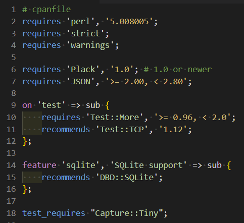
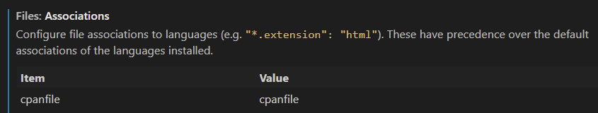

# perlcpanfile README

This is the README for your extension "perlcpanfile". After writing up a brief description, we recommend including the following sections.

## Features

Describe specific features of your extension including screenshots of your extension in action. Image paths are relative to this README file.

For example if there is an image subfolder under your extension project workspace:

\!\[feature X\]\(images/feature-x.png\)

> Tip: Many popular extensions utilize animations. This is an excellent way to show off your extension! We recommend short, focused animations that are easy to follow.

# Makes Perl cpanfile awesome

The syntax highlighter for Perl cpanfile in Visual Studio Code.

## Associate cpanfile in VS Code

Set file associations for cpanfile like below.

## License

This extension is distributed under MIT license.
